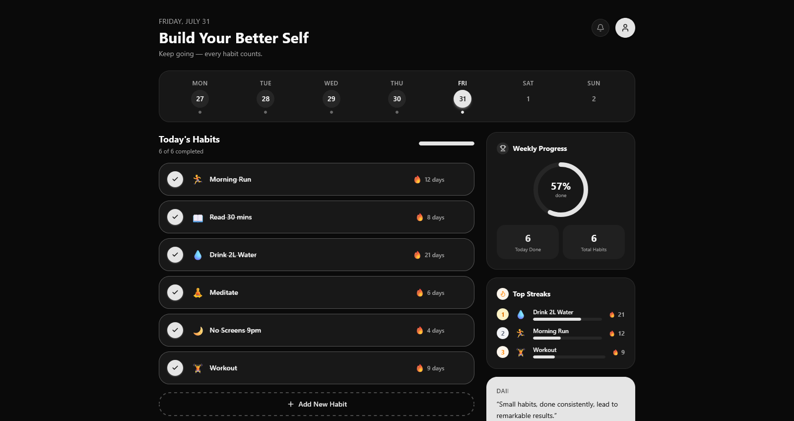

# HabitFlow

> *"Small habits, done consistently, lead to remarkable results."*

A sleek, dark-themed habit tracking app that helps you build and maintain daily routines through streaks, weekly progress, and motivational insights.

---

## Preview



---

## Getting Started

### Prerequisites

- Node.js >= 18
- npm or yarn

### Installation

```bash
git clone https://github.com/kinnaamf/habitflow.git
cd habitflow
npm install
```

### Running the app

```bash
npm run dev
```

Open [http://localhost:3000](http://localhost:3000) in your browser.

### Build for production

```bash
npm run build
npm start
```
